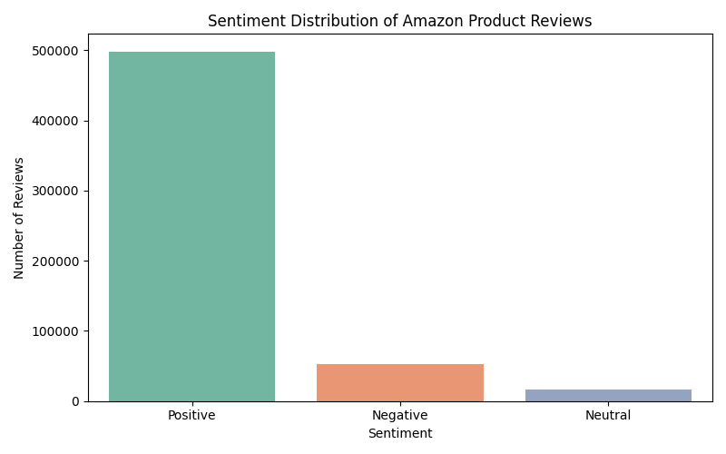
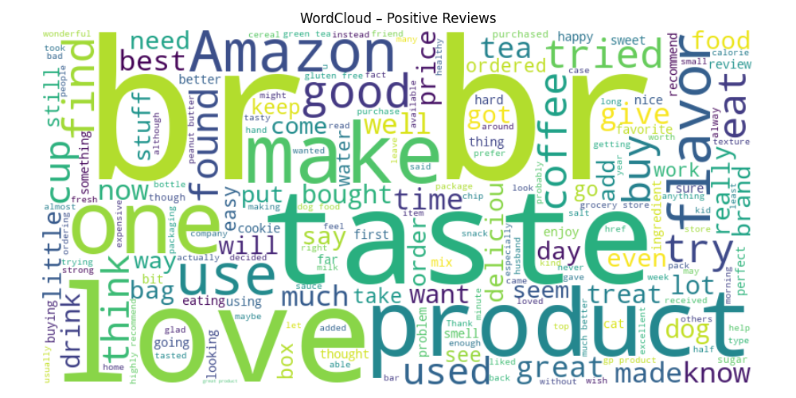
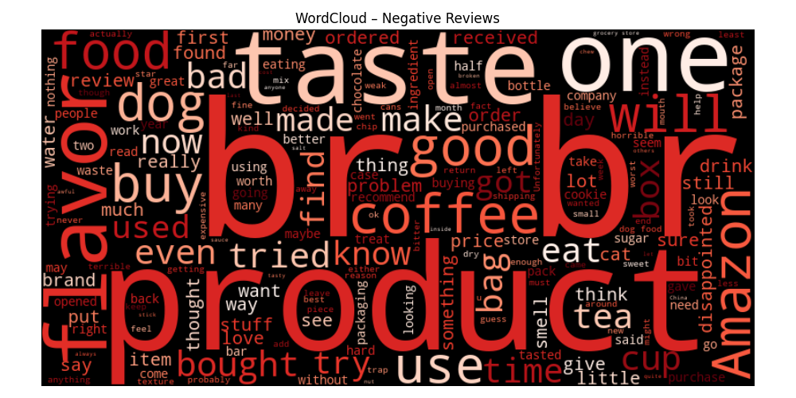

# 🧠 Amazon Product Review Sentiment Analyzer (NLP + Dashboard)

This project analyzes over **568,000 Amazon product reviews** using **NLP and sentiment analysis**, identifies customer satisfaction levels, and visualizes key insights through charts, WordClouds, and an interactive **Streamlit dashboard**.

---

## 📁 Project Structure


---

## 💻 Tech Stack

- Python (Pandas, VADER, tqdm)
- Matplotlib, Seaborn
- WordCloud (for text visuals)
- Streamlit (interactive dashboard)

---

## ✅ Features

| Module                          | Output                                |
|----------------------------------|----------------------------------------|
| Sentiment scoring (VADER)        | Compound polarity scores for all reviews |
| Sentiment labeling               | Positive / Neutral / Negative          |
| Top products by sentiment        | CSV files: most loved / hated products |
| WordClouds                       | Positive & Negative visualizations     |
| Sentiment chart                  | Bar chart showing distribution         |
| Streamlit dashboard              | Real-time filtering & visuals          |

---

## 📊 Sample Visuals

| Sentiment Distribution | WordClouds |
|------------------------|------------|
|  |   |

---

## ▶️ How to Run

1. Clone the repo
2. Install dependencies:
```bash
pip install -r requirements.txt
python Analysis.py
Launch Streamlit dashboard:
streamlit run Analysis_2.py

